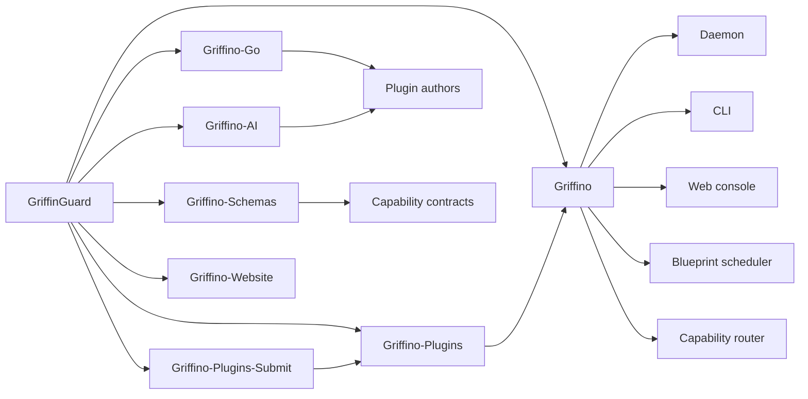

<p align="center">
  
</p>

<div align="center">

# GriffinGuard

**Building Griffino and the open plugin ecosystem around it.**

GriffinGuard is the organization behind **Griffino**, an open standard and local runtime for
capability-routed, user-side plugins. Our work focuses on making plugins portable,
composable, reviewable, and useful across different tools, languages, and providers.

[](https://github.com/GriffinGuard/Griffino)
[](https://github.com/GriffinGuard/Griffino-Go)
[](https://github.com/GriffinGuard/Griffino-Plugins)

</div>

## Organization

GriffinGuard maintains the core Griffino platform and the resources needed to grow its
plugin ecosystem: the runtime, SDKs, schemas, official plugin registry, submission flow,
example plugins, documentation, and design assets.

Our goal is to make local plugins work more like a real ecosystem. A plugin should be able
to declare what it provides, declare what it needs, and connect through stable capability
contracts instead of hard-coded integrations.

## Main Project: Griffino

[Griffino](https://github.com/GriffinGuard/Griffino) is the flagship project of
GriffinGuard.

It is both:

- **An open plugin routing standard** - plugins declare provided and consumed capabilities through manifests and shared schemas.
- **A local runtime implementation** - the Griffino daemon runs plugin containers, manages configuration, routes messages, schedules work, and exposes a web console and CLI.

Key parts of Griffino include:

- Capability-based provider and consumer routing.
- Local plugin lifecycle management.
- Docker-based plugin execution.
- Web console and CLI control surfaces.
- Blueprint task scheduling.
- Plugin registry integration.
- Metrics, tracing, and operational tooling.

## Main Member

| Member | Role | Focus |
| --- | --- | --- |
| [@MorCherlf](https://github.com/MorCherlf) | Founder and main maintainer | Griffino architecture, runtime, SDKs, official plugins, documentation, and release direction. |
| [@GriffinoBot](https://github.com/GriffinoBot) | Automation account | Registry publishing, signed automated updates, and release workflow support. |

## Resources

| Resource | Link | Purpose |
| --- | --- | --- |
| Runtime | [Griffino](https://github.com/GriffinGuard/Griffino) | Main platform, daemon, CLI, web console, and standard documentation. |
| WebUI | [Griffino-WebUI](https://github.com/GriffinGuard/Griffino-WebUI) | WebUI for main system Griffino. |
| Go SDK | [Griffino-Go](https://github.com/GriffinGuard/Griffino-Go) | SDK for building Griffino plugins in Go. |
| Python SDK | [Griffino-Python](https://github.com/GriffinGuard/Griffino-Python) | SDK for building Griffino plugins in Python. |
| Java SDK | [Griffino-Java](https://github.com/GriffinGuard/Griffino-Java) | SDK for building Griffino plugins in Java. |
| C# SDK | [Griffino-CSharp](https://github.com/GriffinGuard/Griffino-CSharp) | SDK for building Griffino plugins in C#. |
| Interface schemas | [Griffino-Schemas](https://github.com/GriffinGuard/Griffino-Schemas) | Shared contracts for plugin capabilities and interoperability. |
| Plugin registry | [Griffino-Plugins](https://github.com/GriffinGuard/Griffino-Plugins) | Official read-only plugin registry consumed by Griffino clients. |
| Plugin submission | [Griffino-Plugins-Submit](https://github.com/GriffinGuard/Griffino-Plugins-Submit) | Submission path for publishing or updating official registry plugins. |
| Website | [Griffino-Website](https://github.com/GriffinGuard/Griffino-Website) | Website and public-facing project materials. |
| Documentation | [Docs](https://github.com/GriffinGuard/Docs) | Additional documentation and project resources. |

## Project Map



## For Users

Start with the main project:

```bash
brew install GriffinGuard/tap/griffino
griffino daemon
```

Then open the local console:

```text
http://127.0.0.1:7070
```

## For Developers

Use the Go SDK to build plugins:

```bash
go get github.com/GriffinGuard/Griffino-Go
```

Useful starting points:

- Read the main runtime documentation in [Griffino](https://github.com/GriffinGuard/Griffino).
- Use [Griffino-Go](https://github.com/GriffinGuard/Griffino-Go) / [Griffino-Python](https://github.com/GriffinGuard/Griffino-Python) for plugin development.
- Define shared capability contracts in [Griffino-Schemas](https://github.com/GriffinGuard/Griffino-Schemas).
- Submit official plugin registry updates through [Griffino-Plugins-Submit](https://github.com/GriffinGuard/Griffino-Plugins-Submit).

## What We Care About

- **Open standards** - capability contracts should be stable, inspectable, and independent of one implementation.
- **Local control** - users should keep their runtime, credentials, plugin state, and configuration on their own machine.
- **Composable plugins** - plugins should connect by what they can do, not by private knowledge of each other.
- **Auditable distribution** - official plugin metadata and image references should be reviewed and traceable.
- **Practical developer experience** - SDKs and docs should make real plugin development straightforward.


<div align="center">

**GriffinGuard is the home of Griffino: a local-first plugin platform built around capability routing.**

</div>
